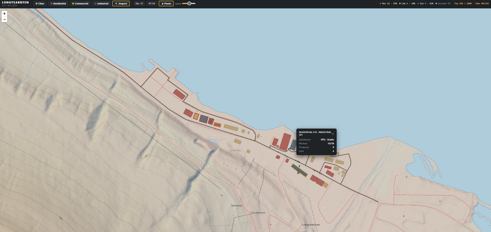

# Longyearbyen City

A browser-based city builder simulation set on real geodata from Longyearbyen, Svalbard.

## What it is

Zone buildings as residential, commercial, or industrial, then watch inhabitants arrive from the airport and move through the city. An economic supply chain flows between zone types — industrial production feeds commercial restocking, which serves residential demand. Agents respond to local conditions, and buildings upgrade or downgrade based on occupancy and satisfaction over time.

The simulation runs on hand-traced geodata from actual NP Basiskart tiles, so the streets and building footprints are real.



*Phase 0: the airport corridor down to Sentrum, with residential (red), commercial (blue/yellow), and industrial (green) zones active.*

## How to run

Open `phases/phase-0/longyearbyen-sim.html` in any browser. No server, no build step.

## Stack

- **Leaflet 1.9.4** — map rendering
- **SVG overlay** — agent visualization
- **Dijkstra pathfinding** — road routing with lazy-cached nodes
- **NP Basiskart WMTS** — base map tiles (Norwegian Polar Institute)
- **Vanilla JS, single HTML file** — no dependencies to install

## Project layout

```
phases/phase-0/
├── longyearbyen-sim.html    # main simulation
├── longyearbyen-draw.html   # hand-drawing tool for geodata
├── geodata-phase0.json      # 6 roads, ~37 buildings
├── phase0-simulation.png    # screenshot of the completed Phase 0 prototype
└── SPEC.md                  # phase spec snapshot

changelog/
└── CHANGELOG.md

CHARTER.md    # goals, scope, phases
TASKS.md      # task breakdown
NOTES.md      # architecture decisions and open questions
RISKS.md      # risk register
NOW.md        # current working state
```

## Status

- **Phase 0** — complete. Proof of concept running end-to-end.
- **Phase 1** — active. Expanding geodata coverage and fixing road connectivity.
- **Phase 2–3** — not started.

## Geodata

All geometry is hand-traced in `longyearbyen-draw.html` on top of NP Basiskart tiles. Current coverage includes the airport corridor down to Sentrum and the western fringe of Elvesletta. Full central Longyearbyen coverage (Sentrum, Lia, Nybyen, Elvesletta) is the Phase 1 goal.

Geodata sourcing may switch to an automated or hybrid OSM-extraction method — evaluation pending.

## Architecture

The simulation is a single HTML file throughout all phases. Internally it is divided into sections — World Config, Data Model, Road Network, Simulation Engine, Renderer, UI — with no cross-section coupling except via a shared Day State object written at the end of each simulated day.

The map renderer (Leaflet) and the simulation engine are fully decoupled: the engine never calls Leaflet, the renderer never runs economy logic.

## Known issues (Phase 1)

- Road branches (S2, S3, S28, S38, S39) are not connected to S1 via intersection detection — agents only route along the main spine (TASK-005).
- Economy constants need tuning (deferred to Phase 2).
